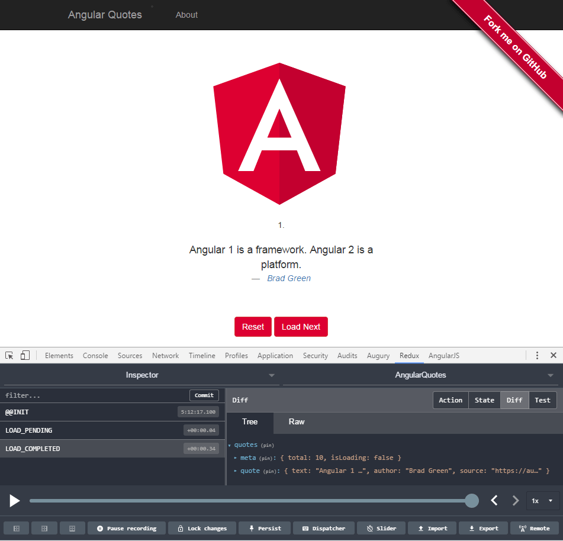

# AngularQuotes

This is just a little demo to get used with the Angular bindings for [Redux](https://github.com/reactjs/redux) ([angular-redux](https://github.com/angular-redux/store)).

# seamless-immutable library instead of immutable.js

This version uses [seamless-immutable](https://github.com/rtfeldman/seamless-immutable) with type definitions.
Seamless-immutable offers better JS interoperability and compatiblity with TypeScript.
It ensures immutability all the way down, see this issue on [Github](https://github.com/facebook/immutable-js/issues/473),

So you can rely on immutable things being actually immutable.
It does not allow any mutable objects inside -- which would break things on strange places.

### See the [branch immutable.js](https://github.com/angular-buch/angular-quotes/tree/immutable.js) for an alternative implementation.

## Development server
Run `ng serve` for a dev server. Navigate to `http://localhost:4200/`. The app will automatically reload if you change any of the source files.

## Build

Run `ng build` to build the project. The build artifacts will be stored in the `dist/` directory. Use the `-prod` flag for a production build.

## Running unit tests

Run `ng test` to execute the unit tests via [Karma](https://karma-runner.github.io).

